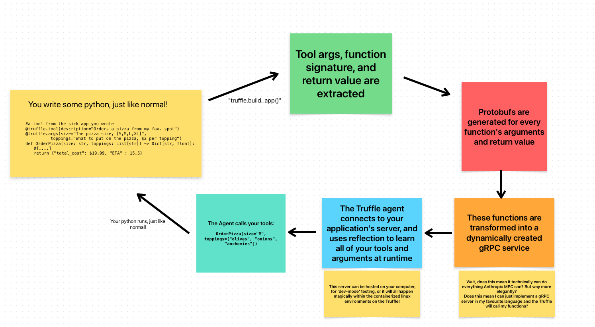

# Truffle SDK - Launch Day Preview
This is an early preview for the soon to be released the Truffle SDK! It's meant to provide a taste of what creating agentic applications for the Truffle^1 is like.

[Check out Yang, a sample app, here!](https://github.com/deepshard/trufflesdk/blob/main/hisnameisyang.py)

### Overview

Apps for the Truffle are a 'toolbox in a sandbox'. That is, they are a set of tools for our agentic models to use, running within an ephemeral Ubuntu ARM container with all app-defined prequisite packages automatically installed.

While developing your app, you can run it locally on your computer, put the Truffle^1 into dev mode, and the Truffle will call your local app instance as though it was running on the device, making debugging and testing extremely simple. 

The SDK works by parsing an app's tools into a gRPC server at runtime. It generates a method handler and Protobuf messages for each tool's arguments and return types. 
While we're starting with Python, this approach makes it easy to extend the SDK to any language.

Inside your application you are free to use the full power of our inference engine, access a vector datastore, request user input in the UI, and more! That means you can make tools that use inference, tools that create files, tools that can do anything you dream up!

### Tool Definitions
- Tools must take arguments and return values that can be expressed through base types
  - That is, they must be serializable! Nested objects that are all serializable are okay, but you can't pass an instance of a webserver as a function parameter for example!
  - Unfortunately, to make the magic happen, type annotations for parameters and return values are required
    - e.g. `def MyTool(self, search_query: str, num_results: int) -> List[str]:` 
- Tools are marked by decorators the `truffle.tool` decorator
  - `truffle.tool` denotes the function, an optional (but highly recommended) description, and an optional icon (Apple SF Symbol for now)
     - e.g. `@truffle.tool("MyTool searches DuckDuckGo for relevant results", icon="magnifyingglass")`
  - `truffle.args` can optionally (but again, is highly recommended) be used to add descriptions to each parameter to aid the model in using the tool
     - e.g. `@truffle.args(search_query='keywords or subjects to search for', num_results='the maximum number of results to return')`

- To assemble an app, you simply wrap these tools in a class
  - Any member variables of the class are automatically serialized and stored allowing apps to be stateful
    - State from a task using the app will be automatically serialized and restored when an app is loaded or saved
    - Examples of persistant state include API keys, search history, etc.
  - The class must contain a member variable of the type, `truffle.AppMetadata`, with the following information about the app:
    - **Full name:** A user facing name for the app
    - **Description:** A user facing description of the app. This is also used to generate synthetic data for live classification
    - **Name:** Internal app name
    - **Goal:** The purpose of the app. It is presented to the core mixture-of-models almost as a system prompt
    - **Icon URL:** The primary icon for the app. Must be 512x512 PNG

- There are built-in types that can be used to display information in special ways in the UI
  - `truffle.Code`
  - `truffle.TruffleFile`
    - This finds and attaches the file at the specified path alongside the tool's response

### Available APIs
This is one part we definitely want to hear your feedback on!
If you need something to build what you are dreaming of, let us know!

- General LLM Inference 
  - Fully featured with structured JSON schema output, temperature and sampling adjustment, and selecting from our range of models  
  - Synchronous and streaming generations
- Vision Model Inference
  - Same features as above, with optimizations for image interpretation and OCR tasks!
- Text Embeddings
  - Access raw embeddings of text up to ~32 thousand characters long and use our per-app key-value vector store
  - Per-app VecDB will be simplistic in query complexity, but still powerful
- User Requests
  - Need an API key for your tool? Directly send a message to the client from within a toolcall with this method!

### Feedback! 
What do you need to build your Truffle app? Let us know in the issues page!

      
      
